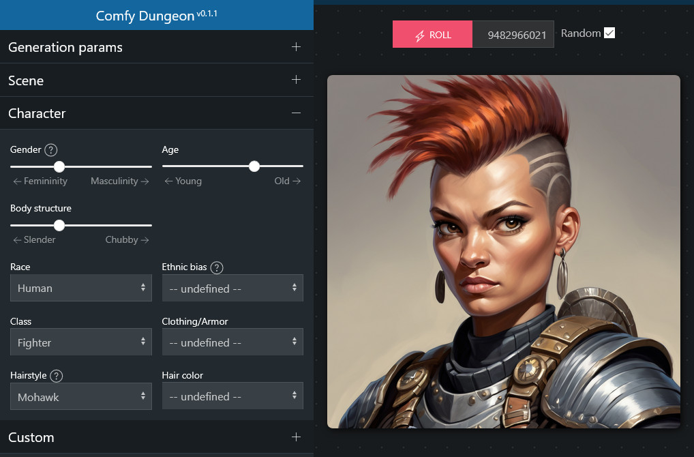

# Comfy Dungeon
Build D&D Character Portraits with ComfyUI.

**IMPORTANT:** At the moment this is mostly a tech demo to show how to build a web app on top of ComfyUI. The code is *very* messy and the application doesn't guaratee consistent results.

Please let me know your thoughs and if you would like this repository to be implemented and expanded into a more feature rich application.

Let me know what you think on discord: https://discord.com/invite/W2DhHkcjgn

You can find a video introduction [here](https://youtu.be/anYHG37fUg4).

## Installation

Download or git clone this repository in the ComfyUI `custom_nodes` directory. You then can access it going to the URL: `http://[comfy address]:[comfy port]/dungeon`. Eg: `http://127.0.0.1:8188/dungeon`

This extension requires the following checkpoints:

- [Proteus V0.3](https://huggingface.co/dataautogpt3/ProteusV0.3/resolve/main/ProteusV0.3.safetensors?download=true) (doesn't work with other versions)
- [DreamShaperTurbo v2.x](https://huggingface.co/Lykon/dreamshaper-xl-v2-turbo/resolve/main/DreamShaperXL_Turbo_v2_1.safetensors?download=true) (only needed for the "cinematic" results, not needed for illustrations)
- [SDXL LCM Lora](https://huggingface.co/latent-consistency/lcm-lora-sdxl/resolve/main/pytorch_lora_weights.safetensors?download=true).

CD also needs the [ComfyUI Essentials](https://github.com/cubiq/ComfyUI_essentials) extension. You can install it from the Manager.

**Important:** The LORA needs to be renamed to `lcm-lora-sdxl.safetensors` or you can set your own name in the `web/js/basic_portrait_lcm.json` by changing the  `"lora_name": "[FILENAME HERE]"` value at the top of JSON.

## Access Comfy Dungeon from your network

Running ComfyUI with the `--listen 0.0.0.0 --enable-cors-header '*'` options will let you run the application from any device in your local network. **Caution!** this might open your ComfyUI installation to the whole network and/or the internet if the PC that runs Comfy is opened to incoming connection from the outside. This is not usually the case as most home routers don't allow direct connection from the outside but you need to know what you are doing.

## How could Comfy Dungeon evolve

At the moment there's no plan on spending more time on this application but based on the interest and feedback the following are the improvements I'm thinking about:

- First of all code cleanup and improved interface (more visual)
- Consolidate the styles, races, classes, extend the options check better models suitable for fantasy
- Add more scenarios (cyberpunk, steampunk, ...)
- Add option to upload a photo to make a d&d character of yourself
- Add options to create specific armors and details (with IPAdapter)
- Once the character is generated add option to inpaint
- Create the full body shot, not just the potrait
- Create group shots for the whole party
- Familiars! (wolves, little dragons, owls, hawks, ...)
